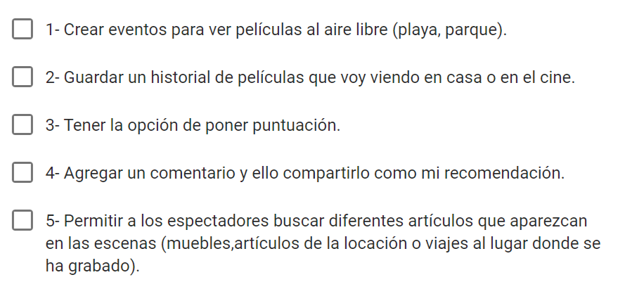
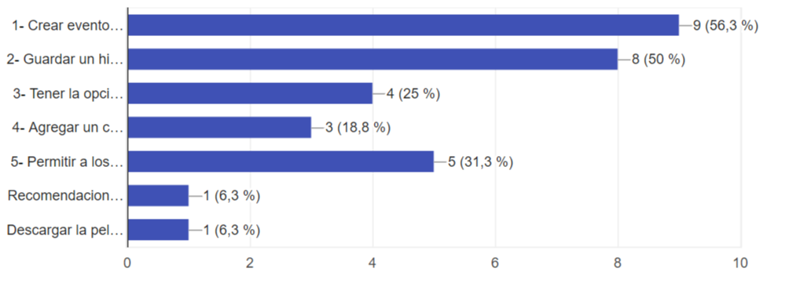
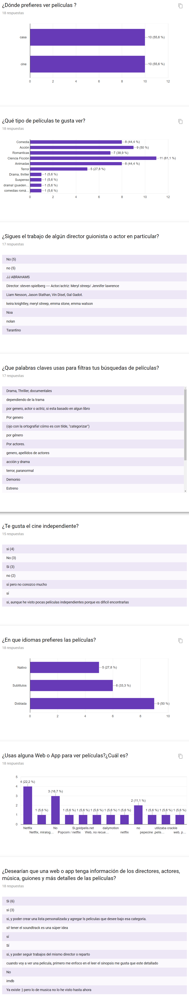
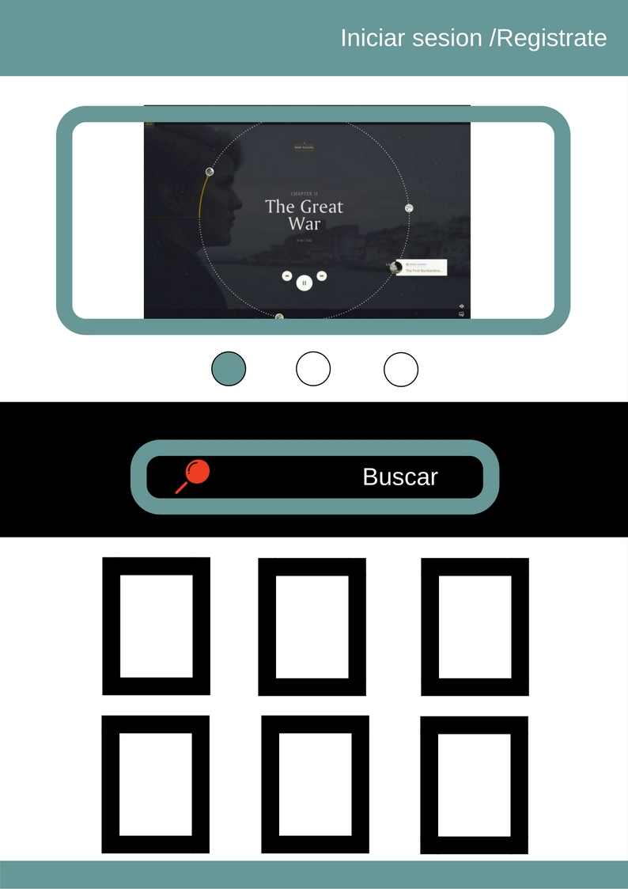
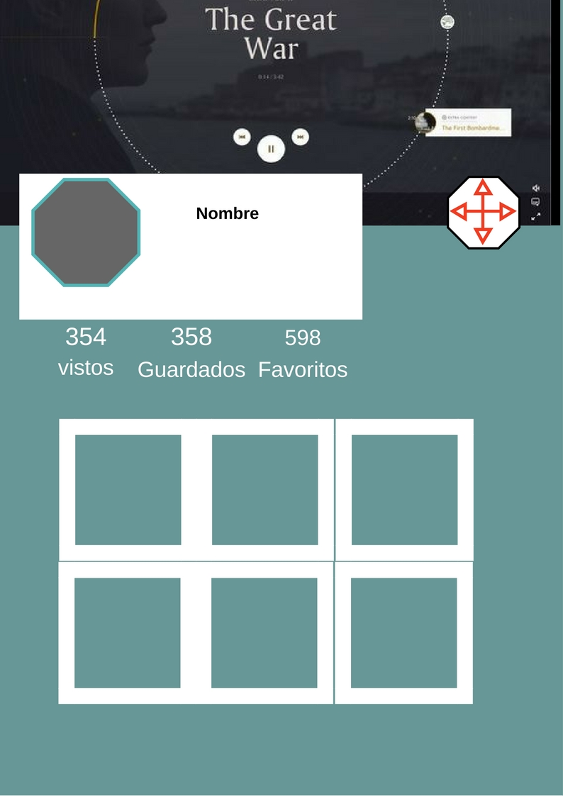
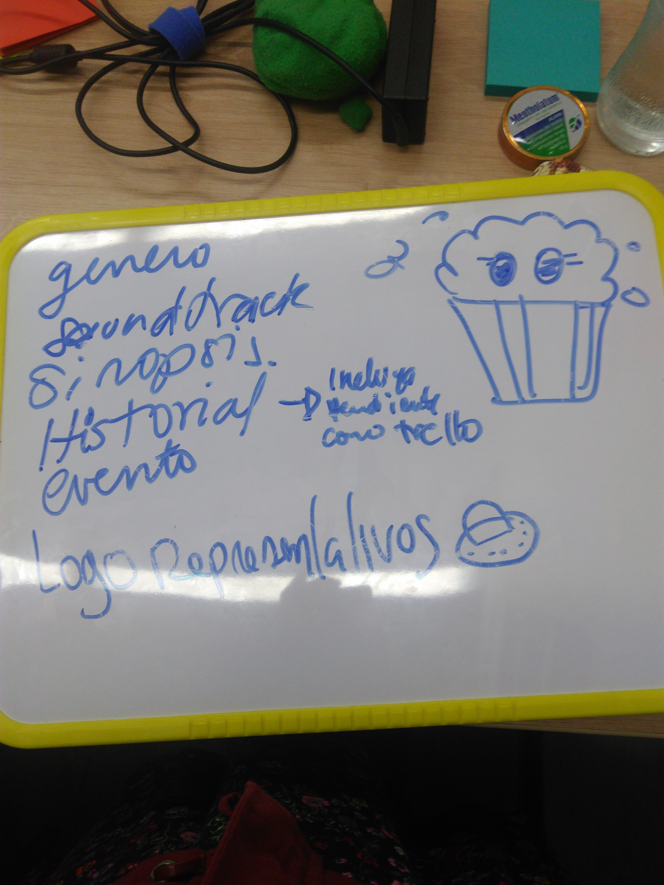

## Dia 1
Organización
- Nos Organizamos y todas realizamos una lluvia de ideas para poder evaluar la problemática ,según nuestras propias experiencias.
Ideas (debatimos):  
  

- Luego hicimos un formulario de preguntas abiertas para nuestros futuros usuarios.
Estas fueron sus respuestas:  

Y llegamos a la conclusión de una problemática :
Había personas que querían tener un lugar para guardar sus películas favoritas un historial que les recuerde que películas han visto ,que películas, querían guardar para verlas después y cuales habían marcado como favoritas.

Netflix nuestra principal competencia no tenia esta opción (No le daba mucha importancia a esa necesidad ya que hay una opción en la que registraban las películas vistas o seleccionadas pero no de manera detallada.)

- Así se realizó Butaca una Web app que te permite tener una agenda de películas y así al ingresar puedas encontrar los nombres de las películas guardadas, vistas y marcadas como favoritas de manera ordenada y detallada para un momento de diversión y pelis.

- Herramientas Utilizadas "Trello".
