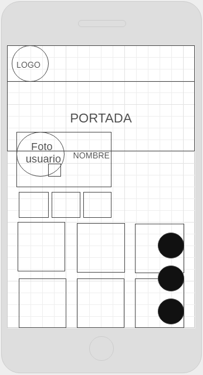

  
**Challenge Hackathon**  
## **REQUERIMIENTOS**  
En esta ocasión la temática será el consumo de películas y para ello crearemos soluciones/productos utilizando el API de Open Movie Database (OMDB) o the movie database

## **ORGANIZACIÓN**
DIA 1 : ENTENDIENDO LAS NECESIDADES DEL USUARIO  
DIA 1 : ANÁLISIS DE LA COMPETENCIA  
DIA 1 : DEFINIR EL PRODUCTO MINIMO VIABLE  
DIA 2: SKETCH DE NUESTRO PROYECTO  
DIA 2 :  PATRONES DE INTERFAZ DE USUARIO (UI): COLORES NEGRO Y AMARILLO (SIMULA LA SENSACION DE ESTAR EN EL CINE.)  
DIA 2 : MAQUETACION WEB  
DIA 2 y 3 :  FUNCIONALIDAD  

## **ENTENDIENDO LAS NECESIDADES DEL USUARIO**

Según las entrevistas que realizamos hay muchas personas que quieren tener un lugar en la Web o App para guardar sus películas favoritas.

## **ANÁLISIS DE LA COMPETENCIA**
Netflix nuestra principal competencia no tenia esta opción (No le daba mucha importancia a esa necesidad ya que hay una opción en la que registran las películas vistas o seleccionadas pero no de manera detallada.)

## **ARQUETIPO**  
  
**EMILIO**    
CINEFILO EMPEDERNIDO    
Hombre • 27 años • Estudiante de Comunicaciones.

Puntos de dolor  
  • Desea ver denuevo una pelicula que le gusto pero no recuerda el titulo de la misma.  
  • Desea tener un espacio para comentar y recomentar sus peliculas.

Necesidades  
• Un lugar para guardar sus peliculas favoritas.  
• Un medio para leer recomendaciones de peliculas.

Objetivos  
• Llevar un record de todas las películas que ha visto en su vida.  
• Ir agregando peliculas adicionales cada vez que las vea.
## **PRODUCTO MINIMO VIABLE**
Filmoteca una Web-App en la cual ademas de buscar las películas que desees y ver su información podrás guardarlas en tu perfil de manera detallada,la cual te recuerda que películas has visto ,que películas has guardado para verlas después y cuales has marcado como favoritas. Y la podrás consultar cuando desees a su vez podrás consultar artículos de tus películas favoritas nosotros te ayudaremos con tu búsqueda.

## **SKETCH**
Vista principal  
  
Vista de las peliculas  
  
Vista perfil  

## **FLUJO DE LA APLICACIÓN**  
1.Registrarse,colocar nombre,correo electronico y contraseña.  
2.Iniciar Sesión con la cuenta que ya registraste.  
3.Buscar tu pelicula Favorita.  
4.Dar click en la pelicula de tu elección y te redirigirá a otra vista.  
5.Dentro de esta vista nueva podras marcar la pelicula como visto, guardar o favorito .  
6.Ingresa a la vista de tu perfil ahí podras ver tres botones y un contador que te indica el numero de peliculas que marcaste como visto, guardar o favorito al dar click en cualquiera de ellos te aparecera la información requerida .  

## **VISTAS DE NUESTRO PROYECTO**
> vistas/movil

### Herramientas Tecnologicas
- Wirefrane  
- Trello
- HTML5  
- CSS3  
- Jquery  
- JS  
- Framework Bootstrap
- Farebase (Autenticación)
- Axios
- API de Open Movie Database (OMDB)

### Integrantes  
- Estrella Benites
- Alejandra Hoces  
- Lidia Ramirez
